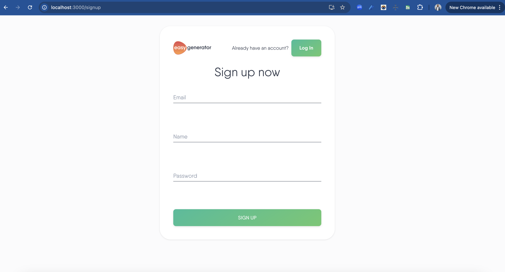
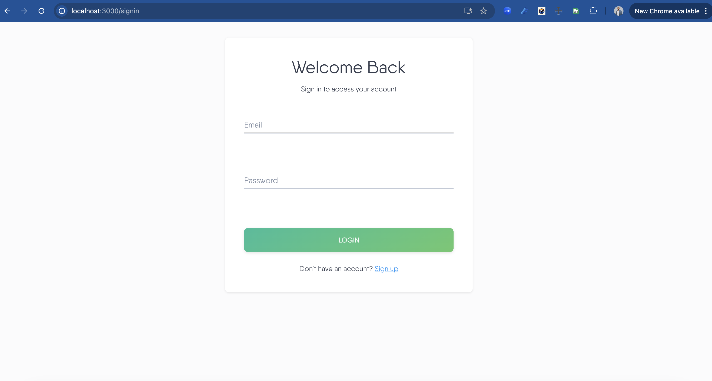
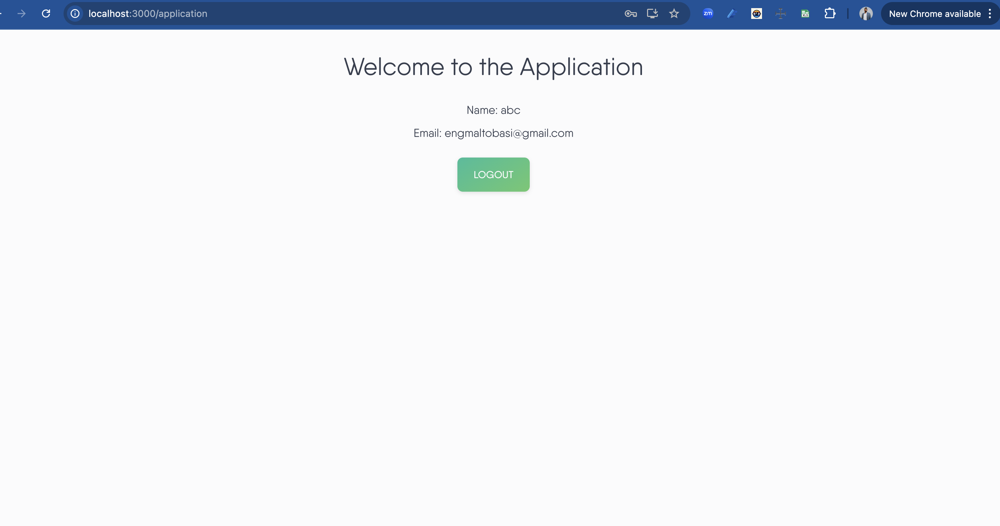

# Full Stack Test Task

## Task Description

This project is a user authentication module that allows users to sign up and sign in to an application. The task includes both front-end and back-end development using the specified technology stacks.

---

## Requirements

### Front-End Development

The front-end component of this task is built using the **React** framework. Below are the requirements for each part of the user authentication flow:

#### Sign-Up Page

- **Purpose**: Create a sign-up form with validation and submit functionality.
- **Fields**:
  - **Email**: User's email address.
  - **Name**: User's full name.
  - **Password**: User's password, with the following requirements:
    - Minimum length of 8 characters.
    - At least 1 letter.
    - At least 1 number.
    - At least 1 special character.
- **Redirect**: After a successful sign-up, users are redirected to the application page.

#### Sign-In Page

- **Purpose**: Create a sign-in form for users who already have an account.
- **Fields**:
  - **Email**: User's email address.
  - **Password**: User's password.
- **Validation**: Basic validation to ensure both fields are filled before submission.

#### Application Page

- **Purpose**: Display a welcome message.
- **Message**: "Welcome to the application."

### Back-End Development

The back-end is implemented using the **NestJS** framework with **MongoDB** as the database. Below are the requirements and implementation notes:

#### Requirements

- **Sign-Up and Sign-In Endpoints**:
  - **Sign-Up**: Allows new users to register with the required fields and password validation.
  - **Sign-In**: Authenticates existing users and provides an access token upon successful login.

- **Technical Stack**:
  - **Framework**: NestJS
  - **Database**: MongoDB
  - **ORM**: Chosen ORM based on the project’s needs (e.g., Mongoose).

#### Nice-to-Have Features

- **TypeScript**: The project is developed using TypeScript.
- **Logging**: Basic logging is implemented on the backend to track authentication actions.
- **Security**: Followed security best practices, including hashing passwords, using environment variables, and applying `httpOnly` cookies for secure session management.

---

## Project Setup and Usage

### Prerequisites

- Node.js and yarn installed.
- MongoDB installed and running locally, or access to a MongoDB Atlas instance.

### Installation

1. **Clone the Repository**:

   ```bash
   [git clone <repository-url>](https://github.com/al6obasi2020/auth-app.git)
   cd auth-app
## Installation

### Install Dependencies

- **For the front-end**:

  ```bash
  cd frontend
  yarn install

cd backend
yarn install

PORT=4000
MONGODB_URI=<your-mongodb-connection-string>
JWT_SECRET=<your-secret-key>

- Start the Back-End Server:
cd backend
yarn start:dev
 
- Start the Front-End Server:
cd frontend
yarn start

## Application Flow

- Sign-Up: A new user can sign up with email, name, and password, meeting the password complexity requirements.
- Sign-In: Existing users can log in with email and password to receive an access token.
- Application Page: After signing in, users are directed to the application page displaying a welcome message.






